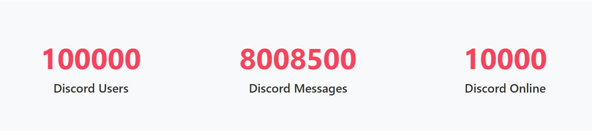

# DiscordStatscounter Component

## Description

The `DiscordStatscounter` component displays three animated statistical counters with labels using Svelte’s `tweened` store and Sveltestrap's responsive layout system.  
It is ideal for displaying key Discord server metrics such as total users, total messages, and online users.  
Each counter features a smooth animation and unique easing behavior.

---

## Usage

Use this component to render **exactly three** animated counters.  
Each counter counts from `0` to a given `max` value and displays a label underneath.

---

## Props

| Prop Name         | Type            | Default | Description |
|-------------------|-----------------|---------|-------------|
| `discordCounters` | `Array<Object>` | `[]`    | An array of **exactly three** objects. Each object must contain:<br>• `max` (`number`): The final value to animate up to.<br>• `label` (`string`): A label describing the statistic. |

> **Note**: The component supports exactly **three** counters. Passing more or fewer may cause errors or visual inconsistency.

---

## Example

```svelte
<script>
    import DiscordStatscounter from '$lib/components/statscounters/DiscordStatscounter.svelte';

    const data = {
        statistics: [
            {
                totalUsers: 5230,
                totalMessages: 158239,
                onlineUsers: 420
            }
        ]
    };

    const stats = data.statistics[0];

    const discordCounters = [
        { max: stats.totalUsers, label: 'Discord Users' },
        { max: stats.totalMessages, label: 'Discord Messages' },
        { max: stats.onlineUsers, label: 'Discord Online' }
    ];
</script>

<main>
    <DiscordStatscounter {discordCounters} />
</main>

```
This example is available for build and test at [Examples](../examples/discordstatscounter.md)

The above code outputs:

