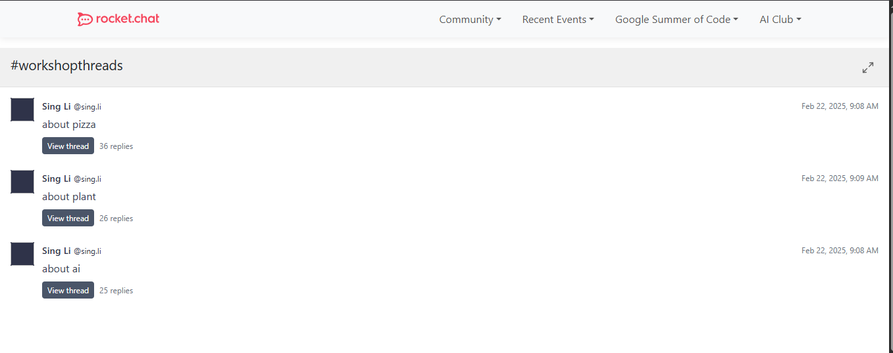

# EmbeddedChat Component

## Description

The `EmbeddedChat` component is one designed to display the most engaging threads in a given rocket.chat channel at any moment in time, along with details like the number of replies in each threads, the date the thread was created and a "View Thread" button that links back to the RC server, all designed as part of the engagement functionality of the Community Hub application.

---

## Props

| Prop Name   | Type       | Description                                                                 |
|-------------|------------|-----------------------------------------------------------------------------|
| `_room_id` | `Array<Object>`   | An array of information on the threads being pulled a room channel (as specified by the room id) from the RC API containing info like the **message**, **id**, and **date of creation** |

### `room_id` prop structure:
export interface Threads {
    id: string;
    message: string;
    tcount: number;
    timestamp: string;
    username: string;
    name: string;
    time_last_replied: string;
}
- **id**: `string` – The id of the respective thread
- **message**: `string` – The first message in the thread
- **tcount**: `number` - Number of replies to the thread
- **timestamp**: `string` – Time of thread creation
- **username**: `string` – Username of the thread owner/creator.
- **name**: `string` – Name of the thread owner/creator
- **time_last_replied**: `string` – Timestamp of the last reply to the thread
---

## Example

```svelte
<script lang="ts">
   import { brand } from "../../../../src/brand";
 import { menutree } from "../../../../src/menutree";
 import { _67b98510c9 } from "../../../../build/_67b98509f520fb810c9c7265";
  import Menubar from '$lib/components/menubar/Menubar.svelte';
import EmbeddedChat from '$lib/components/embeddedchat/EmbeddedChat.svelte';
</script>

<Menubar {brand} {menutree} />
<EmbeddedChat threadList={_67b98510c9}/>
```
This example is available for build and test at [Examples](../examples/embeddedchat.md)

