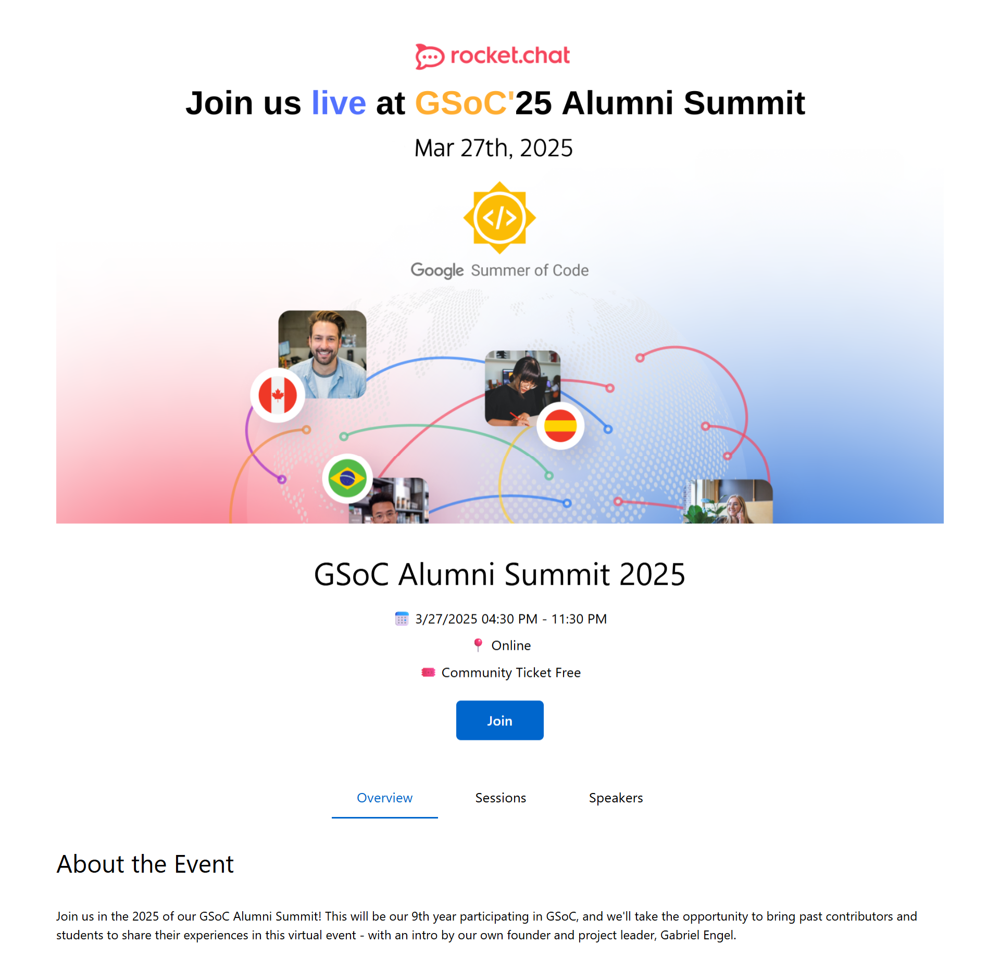

# EventPoster Component

## Description

The `EventPoster` component is a feature-rich and fully responsive event showcase block. It displays key event details including **title**, **schedule**, **venue**, **join link**, along with **tabbed navigation** for viewing the **event overview**, **sessions schedule**, and **speaker details**.

This component is ideal for conferences, webinars, summits, or any event-based page. It enhances user engagement through clear structure, dynamic transitions, and actionable links like "Join" or "Watch Recording".

---

## Props

| Prop Name   | Type       | Description                                                                 |
|-------------|------------|-----------------------------------------------------------------------------|
| `eventData` | `object`   | The complete data structure describing the event, including metadata, sessions, and speakers. |

### `eventData.event` structure:

- **title**: `string` – The title of the event.
- **meetlink**: `string` – URL for joining the event.
- **time_and_date**:
  - `start`: `string` – Start time (ISO string).
  - `end`: `string` – End time (ISO string).
- **location**: `string` – Venue or platform.
- **ticket**: `string` – Ticket information.
- **Overview**: `string[]` – Description of the event.
- **sessions**: `Array` – List of sessions with:
  - `start_time`, `end_time`, `title`, `speaker`, `duration`, `yt_link (optional)`
- **speakers**: `Array` – List of speaker objects with:
  - `name`, `bio`, `image`, `more`, `social (github, email, twitter, linkedin)`

---

## Features

- **Tabbed UI**: Toggle between "Overview", "Sessions", and "Speakers".
- **Dynamic Sessions Table**: Displays sessions with YouTube links (if available).
- **Expandable Speaker Cards**: Learn more about each speaker.
- **Fully Responsive**: Optimized for mobile and desktop views.
- **Join Button**: Directly links to the provided event platform.

---

## Example

```svelte
<script>
  import EventPoster from '$lib/components/EventPoster.svelte';

  let eventData = {
    event: {
      title: 'Alumni Summit 2025',
      meetlink: 'https://meet.example.com',
      time_and_date: {
        start: '2025-06-25T10:00:00Z',
        end: '2025-06-25T16:00:00Z'
      },
      location: 'Main Auditorium',
      ticket: 'Free with Registration',
      Overview: ['This summit brings together alumni from across the country to share knowledge.'],
      sessions: [
        {
          start_time: '10:00 AM',
          end_time: '11:00 AM',
          title: 'Keynote',
          speaker: 'John Doe',
          duration: 60,
          yt_link: 'https://youtube.com/watch?v=abc123'
        }
      ],
      speakers: [
        {
          name: 'Jane Smith',
          bio: 'Tech Lead at InnovateX',
          image: '/images/jane.jpg',
          more: 'Jane has worked on AI solutions for over a decade.',
          social: [{ linkedin: 'https://linkedin.com/in/janesmith' }]
        }
      ]
    }
  };
</script>

<main>
  <EventPoster {eventData} />
</main>
```
This example is available for build and test at [Examples](../examples/eventposter.md)

