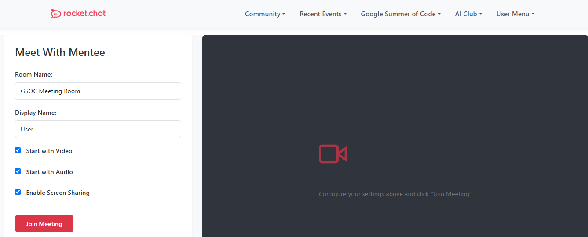

# Meet-with-mentee Component

## Description
The `Meet-with-mentee` component renders a video conferencing component which is used to enable meeting setups between GSOC mentors  and mentees. It also allows users to configure useful meeting presets i.e whether to join with orwithout audio/video. 

---

## Usage

Use this component to enable 2 way audio and video conferencing and video calls between mentors and mentees.

---

## Props


## Example

```agml
use Menubar from $lib/components/menubar/Menubar.svelte
use Jitsi from $lib/components/jitsi/Jitsi.svelte

get brand
get menutree

<main>
<Menubar {brand} {menutree} />
<Jitsi />
</main>
```

The above code outputs as follows:


