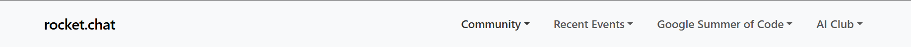

# Menubar Component

## Description
The `Menubar` component is a responsive navigation bar with a brand logo and dropdown menus.
## Usage

Use this component to create a navigation bar with dropdown menus. Ideal for websites or apps requiring a clean and functional menu system.

---

## Props

| Prop Name  | Type          | Default | Description                                   |
| ---------- | ------------- | ------- | --------------------------------------------- |
| `brand`    | `string`      | `""`    | The brand name or logo text.                  |
| `menutree` | `Array<Menu>` | `[]`    | An array of menu items with dropdown options. |

### Menu Structure

Each item in `menutree` should have:

- `top`: The main menu label.
- `dropdown`: An array of dropdown items, where each item has:
  - `label`: The text to display. Use `"---"` for a divider line.

- Each element of the `menutree` array should follow this structure:

```ts
{
  top: string, // The main menu label (e.g., "Products", "Resources")
  dropdown: Array<{
    label: string,     // Text for each dropdown item
    href?: string      // (Optional) Link to navigate to on click
  }>
}
```

---

## Example

```svelte
use Menubar from $lib/components/menubar/Menubar.svelte

get brand
get menutree

<main>
  <Menubar 
    brand="MySite" 
    menutree={[
      {
        top: "Products",
        dropdown: [
          { label: "Pricing", href: "/pricing" },
          { label: "Features", href: "/features" },
          { label: "---" },
          { label: "Documentation", href: "/docs" }
        ]
      },
      {
        top: "Company",
        dropdown: [
          { label: "About", href: "/about" },
          { label: "Careers", href: "/careers" }
        ]
      }
    ]}
  />
</main>
```
This example is available for build and test at [Examples](../examples/menubar.md)

---

The Menubar Component looks as follows:

