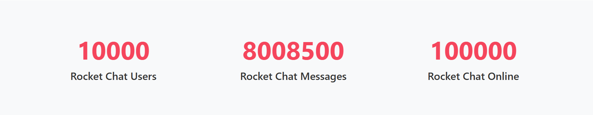

# RCStatscounter Component

## Description

The `RCStatscounter` component displays three animated statistical counters with labels using Svelte’s `tweened` store and Sveltestrap's responsive layout system. It is ideal for displaying key Rocket.Chat metrics such as total users, total messages, and online users. Each counter features a smooth animation and unique easing behavior.

---

## Usage

Use this component to render **exactly three** animated counters. Each counter counts from `0` to a given `max` value and displays a label underneath.

---

## Props

| Prop Name    | Type            | Default | Description |
|--------------|-----------------|---------|-------------|
| `rcCounters` | `Array<Object>` | `[]`    | An array of **exactly three** objects. Each object must contain:<br>• `max` (`number`): The final value to animate up to.<br>• `label` (`string`): A label that describes the statistic. |

> **Note**: The component supports exactly **three** counters. Passing more or fewer may result in errors or visual inconsistency.

---

## Example

```svelte
<script>
	import RCStatscounter from '$lib/components/statscounters/RCStatscounter.svelte';

    const data = {
            statistics: [
                {
                    totalUsers: 100000,
                    totalMessages: 8008500,
                    onlineUsers: 10000
                }
            ]
        };

    const rcstats = data.statistics[0];

	const rcCounters = [
        { max: stats.totalUsers, label: 'Rocket Chat Users' },
        { max: stats.totalMessages, label: 'Rocket Chat Messages' },
        { max: stats.onlineUsers, label: 'Rocket Chat Online' }
    ];

</script>

<main>
	<RCStatscounter {rcCounters} />
</main>

```
This example is available for build and test at [Examples](../examples/rcstatscounter.md)

The above code outputs:

