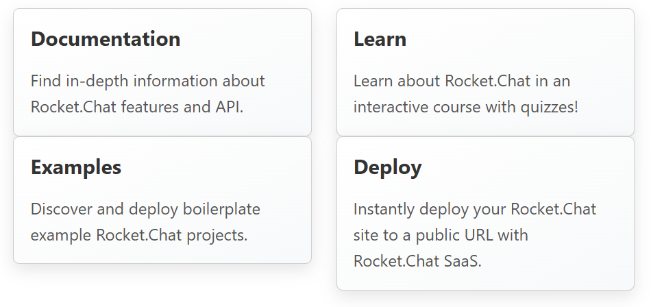

# Simonlinktiles Component

## Description
The `Simonlinktiles` component displays a grid of cards, each containing a title and description.

---

## Usage
Use this component to showcase links, features, or information in a grid layout. Ideal for dashboards, landing pages, or feature highlights.

---

## Props

| Prop Name  | Type          | Default | Description                     |
|------------|---------------|---------|---------------------------------|
| `tilelinks`| `Array<Array<Object>>` | `[]` | A 2D array where each inner array defines a row of tiles. Each tile object should contain: <br>• `title`: string – the tile’s heading <br>• `desc`: string – the tile’s description |

### 🔧 `tilelinks` Structure

```ts
tilelinks = [
  [
    { title: "Docs", desc: "Browse API documentation and usage guides." },
    { title: "Tutorials", desc: "Step-by-step tutorials to get you started." }
  ],
  [
    { title: "Community", desc: "Join forums and discussions." },
    { title: "Support", desc: "Reach out for help and feedback." }
  ]
];
```

---

## Example
```svelte
<script>
    const tilelinks = [[{ title: "Documentation", desc: "Find in-depth information about Rocket.Chat features and API."},
        {title: "Learn", desc: "Learn about Rocket.Chat in an interactive course with quizzes!" },
    ],[ {title: "Examples", desc: "Discover and deploy boilerplate example Rocket.Chat projects."},
        {title: "Deploy", desc: "Instantly deploy your Rocket.Chat site to a public URL with Rocket.Chat SaaS."},
    ],];
</script>
use Simonlinktiles from $lib/components/simonlinktiles/Simonlinktiles.svelte

get tilelinks

<main>
  <Simonlinktiles {tilelinks}/>
</main>
```

---

