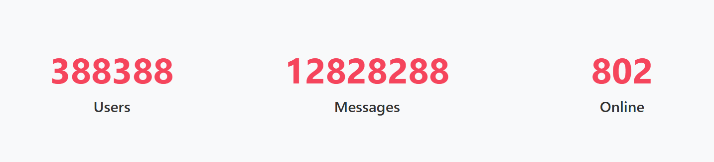

# Statscounters Component

## Description

The `Statscounters` component displays animated counters with labels using smooth transitions powered by Svelte’s `tweened` store.. This component is ideal for showcasing key statistics like user counts, usage metrics, or performance indicators on dashboards, landing pages, or reports.

---

## Usage

Use this component to display a fixed set of three animated statistic counters. Each counter smoothly animates from `0` to a defined `max` value, accompanied by a label.

---

## Props

| Prop Name   | Type            | Default | Description |
|-------------|-----------------|---------|-------------|
| `counters`  | `Array<Object>` | `[]`    | An array of **exactly three** objects. Each object must contain: • `max` (`number`): The target number to count up to. • `label` (`string`): A label that describes the statistic. |

> **Note**: The component is explicitly built to support only **three** counters. Passing fewer or more items may result in rendering issues or runtime errors.

---
## Example
An example of this component in code can be found in [Examples](../examples/statscounters.md)

---

## Component Preview

